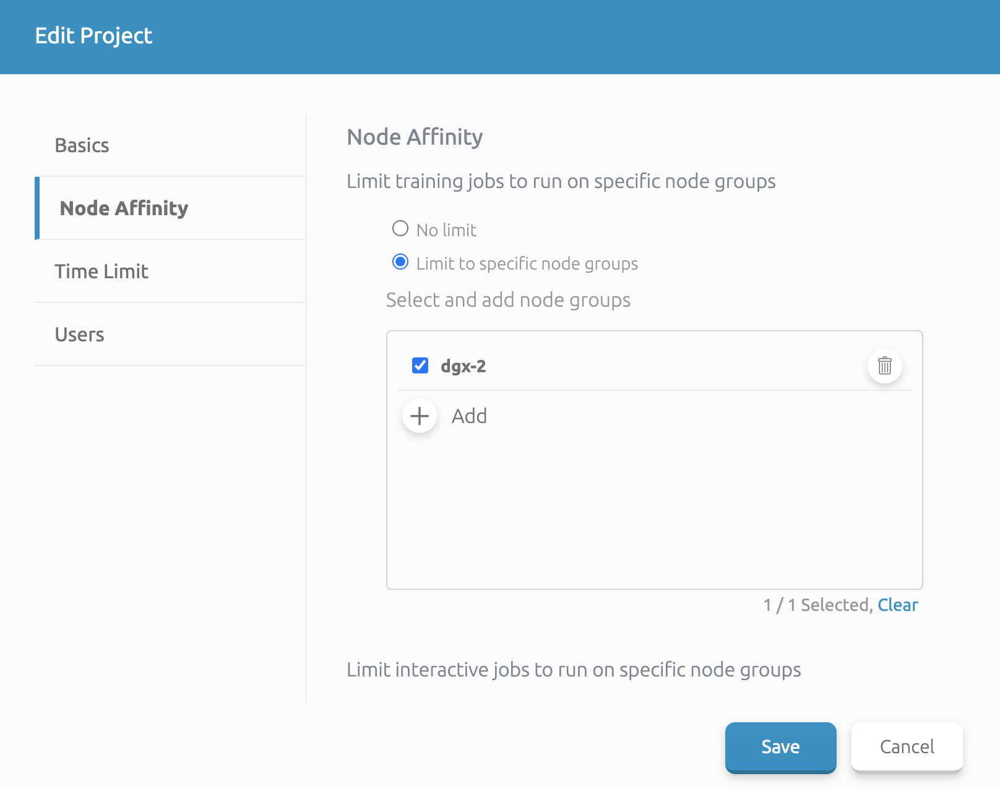
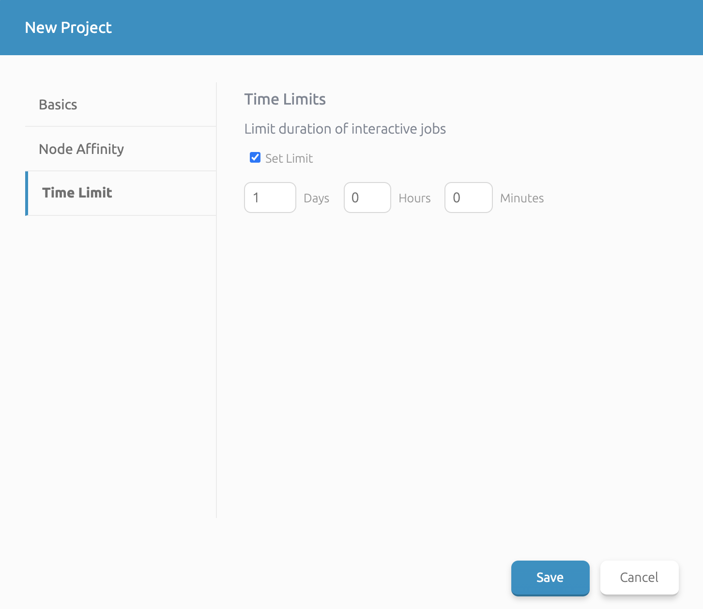

## Introduction

Researchers are submitting workloads via The Run:AI CLI, Kubeflow or similar. To streamline resource allocation and create prioritize, Run:AI introduced the concept of __Projects. __Projects are quota entities that associate a project name with GPU allocation and preferences. 

A researcher submitting a workload needs to associate a project with a workload request. The Run:AI scheduler will compare the request against the current allocations and the project and determine whether the workload can be allocated resources or whether it should remain in a pending state.

## Modeling Projects

As an Admin, you need to determine how to model projects. You can:

*   Set a project per user
*   Set a project per team of users
*   Set a project per a real organizational project.

## Project Quotas

Each project is associated with a quota of GPUs that can be allocated for this project at the same time. This is __guaranteed quota __in the sense that researchers using this project are guaranteed to get this number of GPUs, no matter what the status in the cluster is. 

Beyond that, a user of this project can receive an __over-quota. __As long as GPUs are unused, a researcher using this project can get more GPUs. However, these GPUs can be taken away at a moment's notice. 

__Important best practice:__

As a rule, the sum of the project allocation should be equal to the number of GPUs in the cluster

## Working with Projects

### Create a new Project

Note: to be able to manipulate projects, you must have _Editor_ access. See the "Users" Area

*   Log in to <https://app.run.ai>
*   On the top left, open the menu and select "Projects"
*   On the top right, select "Add New Project".
*   Choose a project name and a project quota. 
*   Press "Save"

### Update an existing Project

*   Select an existing project. 
*   Right-click and press "Edit"
*   Update the values and press "Save"

### Delete an existing project

*   Select an existing project. 
*   Right-click and press "Delete"

## Limit Jobs to run on Specific Node Groups

A frequent use case is to assign specific projects to run only on specific nodes (machines). This can happen for various reasons. Examples:

*   The project team needs specialized hardware (e.g. with enough memory)
*   The project team is the owner of specific hardware which was acquired with a specialized budget
*   We want to direct build/interactive workloads to work on weaker hardware and direct longer training/unattended workloads to faster nodes

While such 'affinities' are sometimes needed, its worth mentioning that at the end of the day any affinity settings have a negative impact on the overall system utilization

### Grouping Nodes 

To set node affinities, you must first annotate nodes with labels. These labels will later be associated with projects. Each node can only be annotated with a __single __name.

To get the list of nodes, run:

    kubectl get nodes

To annotate a specific node with the label "dgx-2", run:

    kubectl label node &lt;node-name&gt; run.ai/type=dgx-2

### Setting Affinity for a Specific Project

To mandate __training__ jobs to run on specific node groups:

*   Create a Project or edit an existing Project.
*   Select "Limit to specific node groups
*   If the label does not yet exist, press the + sign and add the label.
*   Press Enter to save the label
*   Select the label 

To mandate __interactive__ jobs to run on specific node groups, perform the same steps under the "interactive" section in the project dialog.

### Further Affinity Refinement by the Researcher

The researcher can limit the selection of node groups by using the CLI flag --node-type with a specific label. When setting specific project affinity, the CLI flag can only be used to with a node group out of the previously chosen list.  See CLI reference for further information  [runai submit](../../Researcher/Command-Line-Interface-API-Reference/runai-submit.md) 

## Limit Duration of Interactive Jobs

Researchers frequently forget to close Interactive jobs. This may lead to a waste of resources. Some organizations prefer to limit the duration of interactive jobs and close them automatically.

__Warning__: This feature will cause containers to automatically stop. Any work not saved to a shared volume will be lost

To set a duration limit for interactive jobs:

*   Create a Project or edit an existing Project.
*   At the bottom, set a limit (day, hour, minute)

 The setting only takes effect for jobs that have started after the duration has been changed. 