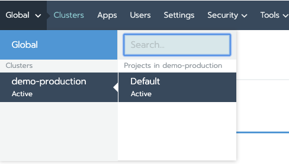

Rancher (<https://rancher.com/>) is a software that manages Kubernetes clusters. Some customers provide Rancher to data scientists in order to launch workloads. This guide provides step by step instructions on how to launch workloads via Rancher. It assumes the reader has some familiarity with Rancher itself.

There are other ways for data scientists to launch Workloads such as the Run:AI CLI or Kubeflow (<https://www.kubeflow.org/>).  The advantage of Rancher is the usage of a user interface. The disadvantage is that it exposes the data scientist to Kubernetes/Docker terminology that would otherwise remain hidden

## Types of Workloads 

We differentiate between two types of Workloads:

*   __Train__ workloads. Training is characterized by a deep learning run that has a start and a finish. A Training session can take from a few minutes to a couple of days. It can be interrupted in the midst and later restored (though the data scientist should save checkpoints for that purpose). Training workloads typically utilize large percentages of the GPU.
*   __Build__ workloads. Build workloads are interactive. They are used by data scientists to code a neural network and test it against subsets of the data. Build workloads typically do not maximize usage of the GPU. Coding is done by connecting a Jupyter notebook or PyCharm via TCP ports

## Terminology

* Kubernetes __Job__ - equivalent to the above definition of a Train workload. A Job has a distinctive "end" at which time the job is either "Completed" or "Failed"
* Kubernetes __StatefulSet__ -  equivalent to the above definition of Build workload. Suited for interactive sessions in which state is important in the sense that data not stored on a shared volume is gone when the session ends. StatefulSets must be manually stopped
* Kubernetes __Labels__ - a method to add key-value pairs to a workload
* Kubernetes __Node__ - a physical machine
* Kubernetes __Scheduler__ - the software that determines which Workload to start on which node. Run:AI provides a custom scheduler named __runai-scheduler__
* __Run:AI Project__. The Run:AI scheduler schedules computing resources by associating Workloads with "Run:AI projects" (not to be confused with Rancher Projects).
    * Each project contains a GPU quota.
    * Each workload must be annotated with a project name and will receive resources according to the defined quota for the project and the currently running Workloads

## Using Rancher to Launch Workloads 

*  Using your browser, navigate to Rancher       
*  Login to Rancher with your user name and password
*  Click on the top left menu, go to the company's assigned cluster and default Rancher project (not to be confused with a Run:AI project)
 

*  Press Deploy on the top right
*  Add a Workload name
*  Choose __StatefulSet__ set for a build workload or __Job__ for a train workload    
*  Select a docker image 
*  Select a Kubernetes Namespace (or remain with "default")

*  Build workloads will typically require the assignment of TCP ports, for example, to externalize a jupyter notebook or a PyCharm editor. Select the ports that you want to expose. For each port select: 
    *   (Optional) an informative name
    *   The internal port used by the software you want to connect to (e.g. Juypter notebook uses 8888 by default)
    *   The type of load balancer you want to use.  For cloud environments this would typically be  a Layer-4 load balancer. On-premise environments depend on the how your cluster was installed.   
*   Select a listening port which would be the external port you access through. Some load balancing solutions allow a random port.  
      

* Expand Node Scheduling and on the bottom right select "show advanced options". Under "Scheduler" write "runai-scheduler"
* On the bottom and select "show advanced options". Expand labels and labels and add 2 labels, adding the name of the user and the name of the project as follows: 

* Expand "Security and Host Config, at the bottom right add the number of requested GPUs
* Press "Launch"  
*   Wait for the Workload to launch. When done, you will see the list of exposed ports and can click on them to launch them in _http_
*   Click on the Workload name, on the right you have a menu (3 vertical dots) which allow you to ssh into the Workload or view logs