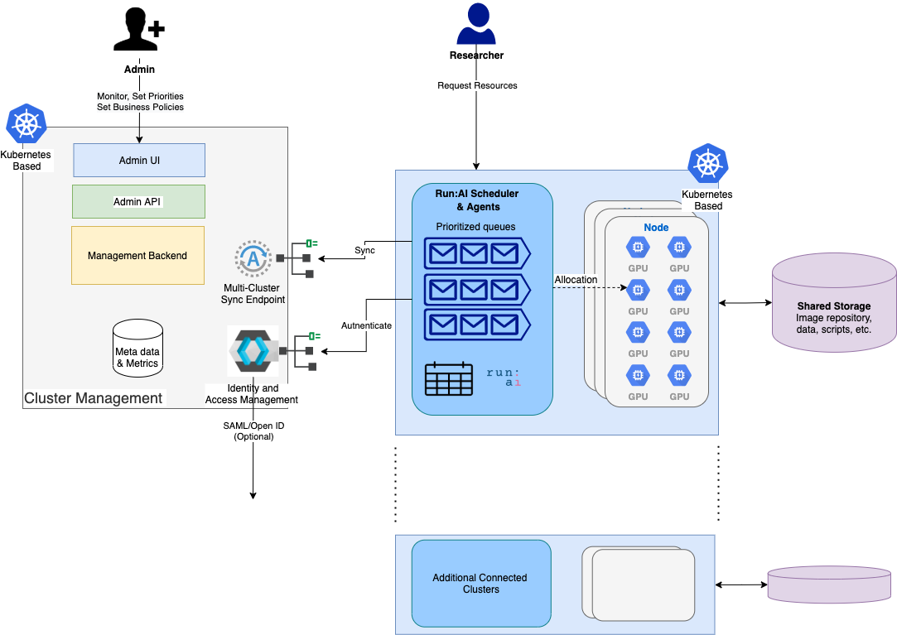

Run:AI consists of two main components:

* The Run:AI [Cluster](../../../home/components/#the-runai-cluster). One or more data-science clusters of nodes.
* The Run:AI [Backend](../../../home/components/#the-runai-cloud). A single entity that monitors clusters, sets priorities, and business policies. 

The Run:AI Backend resides on the cloud. A typical installation of Run:AI installs the Cluster on the customer's data science cluster and requires an outbound communication from the cluster to the cloud. 

With some organizations, this premise is not achievable due to organizational restrictions. As such, Run:AI provides a __local installation of the Backend__ part.

## Airgapped, Fully On-Premise, On-Premise, Cloud

Run:AI has different installation modes:

| Type | Description | Run:AI Properties | 
|------|-------------|-------------------|
| Air-gapped | * The organization has no connection to the internet   * Data entering the organization must do so via offline virus scanning tools | * Run:AI provides a single compressed file which includes the entire installation   * The installation is divided into two phases. The _backend_, which is the part usually on the cloud, and the _cluster_ running on the GPU Nodes |
|  Fully on-prem | The organization can freely download from the internet, though upload is not allowed  | * The installation is divided into two phases. The _backend_, which is the part usually on the cloud, and the _cluster_ running on the GPU Nodes   * The installation connects to the internet for downloading installation artifacts  |
| On-prem (or _Hybrid_) | The typical Run:AI installation which pushes metrics to the Run:AI cloud and is based on an Administration User Interface served from that cloud | [Regular Installation](../Cluster-Setup/cluster-setup-intro.md) | 
| Cloud | Same as On-prem with the customer's GPU cluster being on the cloud | [Regular Installation](../Cluster-Setup/cluster-setup-intro.md) |  

## Kubernetes vs OpenShift

Kubernetes has many [Certified Kubernetes Providers](https://kubernetes.io/docs/setup/#production-environment){target=_blank}. Run:AI has been installed with a number of those such as Rancher, Kubespray, OpenShift, HPE Ezmeral and Native Kubernetes. The Run:AI installation instructions are divided into two separate sections:

* OpenShift-based installation. See [Run:AI OpenShift installation](ocp/overview.md).
* Kubernetes-based installation. See [Run:AI Kubernetes installation](k8s/overview.md).

## Secure Installation

In many organizations, Kubernetes is governed by IT compliance rules. In this scenario, there are strict access control rules during the installation and running of workloads:

* OpenShift is secured using _Security Context Constraints_ (SCC). The Run:AI installation supports SCC.
* Kubernetes is secured using _Pod Security Policy_ (PSP). The Run:AI installation supports PSP.

