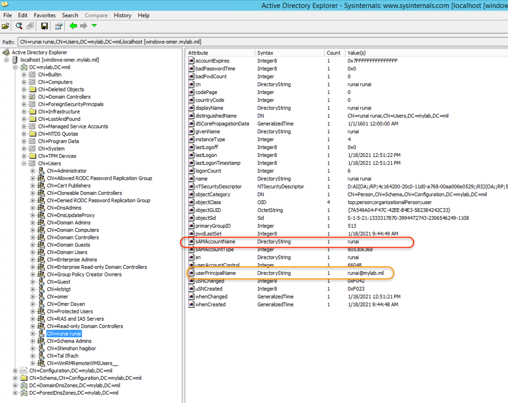

# Integrate Run:AI with the Organization's Directory. 

By default Run:AI uses an internal user directory based on an open-source called [Keycloak](https://www.keycloak.org/){target=_blanks}. Assuming your organization uses a directory to manage users, it is possible to integrate the directory with Run:AI such that a subset of the organization's users will become Run:AI users.

The document below provides step-by-step instructions on how to perform this integration. The integration assumes a protocol called __LDAP__.

## Prerequisites

* Go to your directory and create a user. The user will be used for:

1. The integration between your directory and Run:AI
2. Serves as the first Run:AI Administrator user.

 The user should have read access to the LDAP server. Save the user-name (henceforth `<RUNAI-USER>`) and password (`<RUNAI-PASSWORD>`).

* Get the LDAP Server endpoint (henceforth `<LDAP-SERVER-ENDPOINT>`).

* Get the `Username LDAP attribute` (henceforth `<LDAP-USER-ATTRIBUTE>`). In Active Directory this is `sAMAccountName` as shown in the picture below:



* In the same picture, see the attribute pointing to the user email. Save it as `<USER-PRINCIPAL-NAME>`.

* Get the User DN (Distinguished Name). Henceforth `<USER-DN>`. The User DN is the path in your directory to the location where users are defined. In Active directory the user directory is under: _Forest -> Domain -> OU -> DistinguishNam (DN) -> Objects -> User_.


## Post Backend LDAP Configuration

After installing the Run:AI Backend], Log into Keycloak by browsing to: `https://auth.runai.<company-name>`.


In the Keycloak administration panel, perform the following:

* Verify that you are using the Realm "Runai" (displayed on the top left of the screen).
* Create a new _User Federation_ of type `LDAP`.
* Add an arbitrary name under _Console Display Name_.
* Turn off _Import Users_.
* Set _Edit Mode_ to `READ_ONLY`.
* Under _Vendor_ choose the LDAP directory type (in most cases, this would be `Active Directory`).
* Under _Username LDAP attribute_ set the value of `<LDAP-USER-ATTRIBUTE>`. In Active Directory this would typically be `sAMAccountName`.
* Under _Connection URL_ set the value `ldap://<LDAP-SERVER-ENDPOINT>:389`. Click on _Test Connection_ to verify.
* Under _User DN_ set the value of `<USER-DN>`.
* Under _Bind DN_ and _Bind Credential_ Enter `<RUNAI-USER>` and `<RUNAI-PASSWORD>`. Click on _Test Authentication_ to verify.
* Change _Search Scope_ to `Subtree`.
* Click Save.

Go to the Mappers tab:

* Select _email_. Change the _LDAP Attribute_ to `<USER-PRINCIPAL-NAME>`


Reset the Run:AI Backend:

```
kubectl rollout restart deployment/runai-backend-deployment -n runai-backend
```
