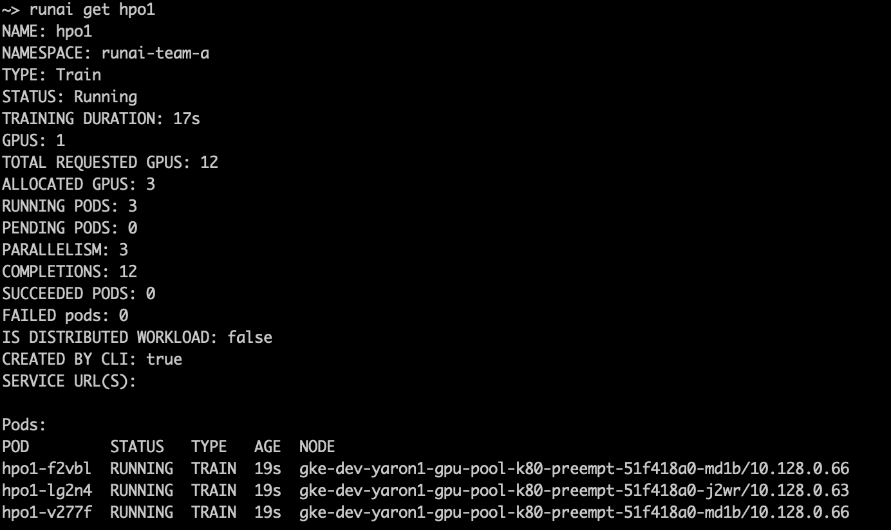

# Walk-through: Hyperparameter Optimization

## Introduction

Hyperparameter optimization (HPO) is the process of choosing a set of optimal hyperparameters for a learning algorithm. A hyperparameter is a parameter whose value is used to control the learning process. Example hyperparameters: Learning rate, Batch size, Different optimizers, number of layers.

To search for good hyperparameters, Researchers typically start a series of small runs with different hyperparameter values, let them run for awhile and then examine the results of the runs to decide what works best.

There are a number of strategies for searching the hyperparameter space. Most notable are __Random search__ and __Grid search__. The former, as its name implies, selects parameters at random while the later does an exhaustive search from a list of pre-selected values.

Run:AI provides the ability to run, manage, and view HPO runs. The following is a walk-through of such a scenario.

## Prerequisites

To complete this walk-through you must have:

*   Run:AI software is installed on your Kubernetes cluster. See: [Installing Run:AI on an on-premise Kubernetes Cluster](../../Administrator/Cluster-Setup/cluster-install.md)
*   Run:AI CLI installed on your machine. See: [Installing the Run:AI Command-Line Interface](../../Administrator/Researcher-Setup/cli-install.md)

## Step by Step Walk-through

### Setup

*   Open the Run:AI user interface at [app.run.ai](https://app.run.ai)
*   Login
*   Go to "Projects"
*   Add a project named "team-a"
*   Allocate _2_ GPUs to the project
*   On shared storage create a library to store HPO results. E.g. ``/nfs/john/hpo``

### Pods

With HPO, we introduce the concept of __Pods__. Pods are units of work within a Job. 

* Typically, each Job has a single Pod. However, with HPO as well as with [Distributed Training](walkthrough-distributed-training.md) there are multiple Pods per Job. 
* Pods are independent
* All Pods execute with the same parameters as added via ``runai submit``. E.g. The same image name, the same code script, the same number of Allocated GPUs, memory.

### HPO Sample Code

### Run an HPO Workload

*   At the command-line run:

        runai project set team-a 
        runai submit hpo1 -i gcr.io/run-ai-demo/quickstart-hpo -g 1 \
                --parallelism 3 --completions 12 -v /nfs:/nfs/hpo

*   We named the job _hpo1_
*   The job is assigned to _team-a_
*   The job will be complete when 12 pods will run (--completions 12), each allocated with a single GPU (-g 1)
*   At most, there will be 3 pods running concurrently (--parallelism 3)
*   The job is based on a sample docker image ``gcr.io/run-ai-demo/quickstart-hpo``. The image contains a startup script that runs selects a set of hyper parameters and then uses them. See [link to file](link-here.md)
*   The command maps a shared volume ``/nfs`` shared volume to a directory in the container ``/nfs/hpo``. The running pods will use the directory to sync hyperparameters and save results.

Follow up on the job's status by running:

        runai list

The result:

Follow up on the job's pods by running:

        runai get hpo1 

You will see 3 running pods currently executing:

Once one of the 3 pods are done, it will be replaced by a new one from the 12 _completions_ until all have run.

You can also submit jobs on another project until only 2 GPUs remain. This will preempt 1 pod and will hencdforth limit the hpo job to run on 2 pods only.

You can see logs of specific pods by running :

        runai logs hpo1 --pod <POD-NAME>

where ``<<POD-NAME>>`` is a pod name as appears above in the ``runai get hpo1`` output 

The logs will contain a couple of lines worth noting:

> Picked HPO experiment #4

> ...

> Using HPO directory /nfs

> Using configuration: {'batch_size': 32, 'lr': 0.001}

XXX

Finally, you can delete the hpo job by running:

        runai delete hpo1

## Next Steps

*   For more information on how to convert an interactive session into a training job, see: [Converting your Workload to use Unattended Training Execution](../best-practices/Converting-your-Workload-to-use-Unattended-Training-Execution.md)
*   For a full list of the ``submit-mpi`` options see [runai submit-mpi](../Command-Line-Interface-API-Reference/runai-submit-mpi.md)
