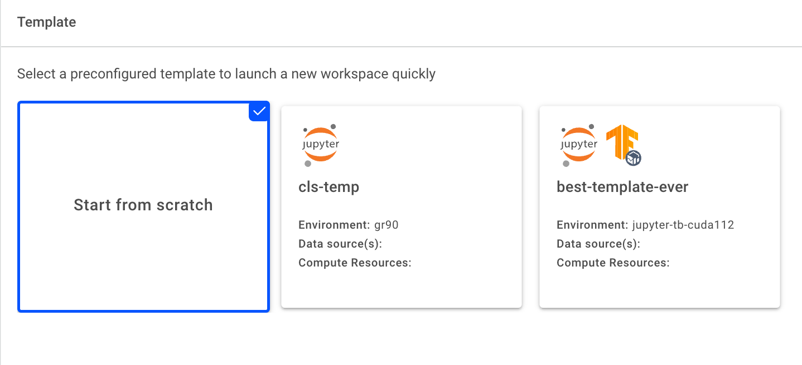
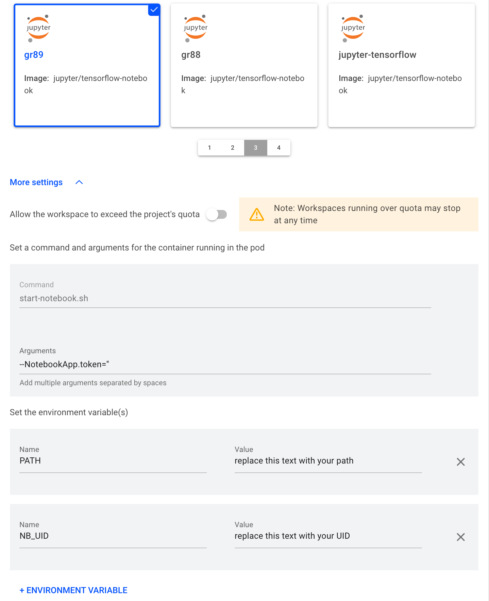
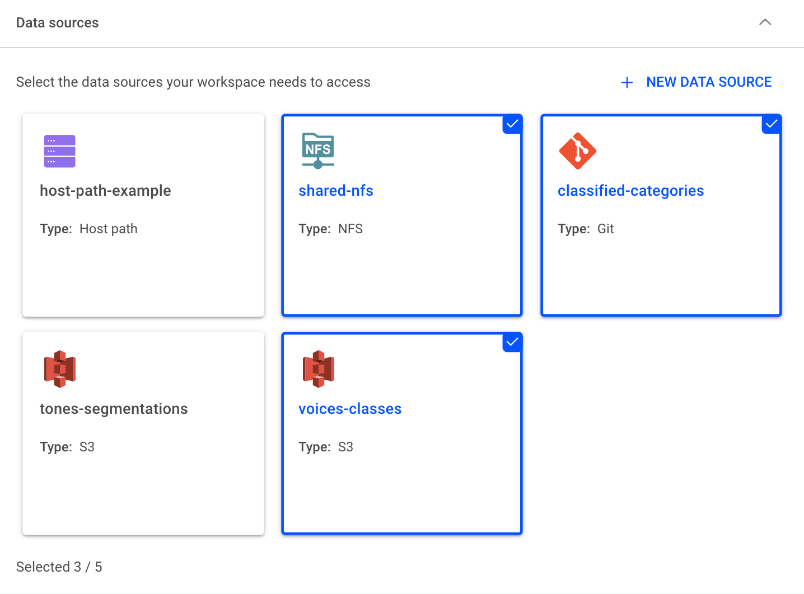
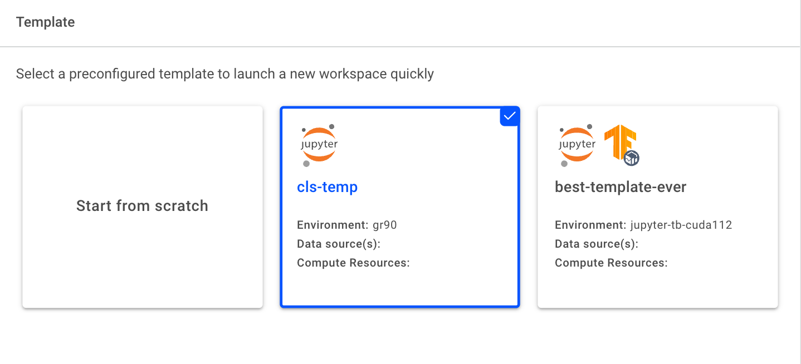

# Workspaces actions and use cases

## Create a new workspace
A Workspace is assigned to a project and is affected by the project’s quota just like any other workload. A workspace is shared with all project members for collaboration.

To create a workspace, you must provide:

* At least one project 
* A researcher assigned to at least one project

To create a workspace, the researcher must select building blocks  in one of two ways:

* Create a workspace __from scratch__:  this allows you to either select an existing building block or create them on the fly (pending the right permissions).
* Create a workspace __from a template__: a template contains a set of predefined building blocks as well as additional configurations which allow the user to immediately create a templated-based workspace.

!!! Note
    Where there is a card gallery, use the search bar to find specific cards based on title or field values.

To create a workspace:

* Press `New Workspace` 
* Select a project for the new workspace. The project visualization contains information about the project such as how much of the quota is being allocated and indicates the likelihood of the workspace being scheduled or left in the queue

## Create a new workspace from scratch

See picture:

!!! Note
    The building block can also be created (and then selected) directly from within the workspace creation form.

### Select an Environment for a new workspace

An environment is a mandatory element of a workspace. All environments created for the project will be shown to researchers in the form of a gallery view (see also [Creating a new environment](../create/create-env.md)). Each tile shows the tools as well as the image. When selecting an environment, the command, arguments and environment variables defined in the environment are visible for review. The researcher can edit arguments and environment variables that are specific to the current workspace and that are not part of the common shared environment. In some cases, it would even be expected that the researcher will provide additional information (for example, values for environment variables) to successfully create the workspace (see also [Create new environment](../create/create-env.md)).

You can also decide whether the workspace is preemptable or not (see also [create a preemptable worksapce](../create/workspace.md#create-a-preemptible-workspace)). By default, interactive sessions are limited to the project’s GPU, meaning that they can only be scheduled (and activated) when there is an available and sufficient GPU quota.  With the following parameter, the researcher can determine whether the workspace is allowed to go over-quota with the understanding that it can be preempted if other projects would demand back their quota.

### Select a compute resource for a new workspace

Selecting compute resources for the workspace is a mandatory step. If compute resources are created for the project (see also [creating a new compute resource](../create/create-compute.md)), those will be offered to researchers in the form of a gallery view. Each tile shows the amount of GPU, CPU and Memory in the request.

### Select a data source for a new workspace

Selecting a data source for the workspace is a non-mandatory step. If data sources are created for the project (see also [creating a new compute resource](../create/create-compute.md)), those will be offered to researchers in the form of a gallery view. Each tile shows the unique name of the building block and the type of data source.

## Create a new workspace from a template

Templates ease the way of creating a new workspace in a few clicks. In contrast to creating a workspace from scratch (selecting manually which building blocks to use in your workspace), a template aggregates all building blocks under a single entity for researchers to use for the creation of workspaces.

A Template consists of the building blocks and other parameters that are exposed in a workspace creation form. Templates can be fully defined to a point researcher can select and create the workspace without providing any additional information or partially defined, hence, leaving some degree of freedom in the creation of the workspace via the template. This can help in cases where only part of the configuration is selected in the template and the rest is expected to be provided by the user creating a workspace from the template. 

Few examples: 

* A template can have the value of an environment variable empty for the researcher to edit later during the workspace creation.
* A template can consist of an environment with a tool that requests a custom URL. This URL field stays empty until the researcher fills it upon creating the workspace

For collaboration purposes, templates are assigned to a specific project and are shared with all project members by design.

## Create a preemptible workspace

For a better experience, workspaces, as they are built for interactive research, are designed to not be preempted (because the researchers actively interact with GPU resources). Thus, non-preemptable workspaces can be only scheduled if the project has a sufficient vacant quota. However, if that’s not the case (the project does not have a sufficient vacant quota) and the researcher still needs to create and activate a workspace (if cluster resources are available) he/she can allow the workspace to go over-quota, thus be scheduled, but with the cost of preemption without prior notice.

