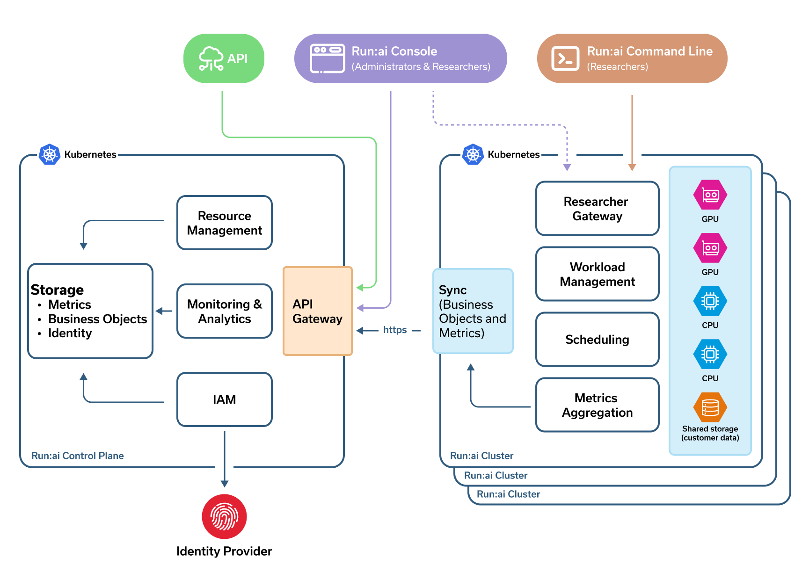

# Run:ai System Components 

## Components

Run:ai is made up of two components:

* The __Run:ai cluster__ provides scheduling services and workload management. 
* The __Run:ai control plane__ provides resource management, Workload submission and cluster monitoring.

Technology-wise, both are installed over a [Kubernetes](https://kubernetes.io){target=_blank} Cluster.

Run:ai users:

* Researchers submit Machine Learning workloads via the Run:ai Console, the Run:ai Command-Line Interface (CLI), or directly by sending YAML files to Kubernetes. 
* Administrators monitor and set priorities via the Run:ai User Interface

## Run:ai Cluster 

* Run:ai comes with its own Scheduler. The Run:ai scheduler extends the Kubernetes scheduler. It uses business rules to schedule workloads sent by Researchers. 
* Run:ai schedules _Workloads_. Workloads include the actual researcher code running as a Kubernetes container, together with all the system resources required to run the code, such as user storage, network endpoints to access the container etc. 
* The cluster uses an outbound-only, secure connection to synchronize with the Run:ai control plane. Information includes meta-data sync and various metrics on Workloads, Nodes etc.
* The Run:ai cluster is installed as a [Kubernetes Operator](https://kubernetes.io/docs/concepts/extend-kubernetes/operator/){target=_blank}
* Run:ai is installed in its own Kubernetes _namespace_ named __runai__
* Workloads are run in the context of Run:ai __Projects__. Each Project is mapped to a Kubernetes namespace with its own settings and access control. 

## Run:ai Control Plane on the cloud

The Run:ai control plane is used by multiple customers (tenants) to manage resources (such as Projects & Departments), submit Workloads and monitor multiple clusters.

A single Run:ai customer (tenant) defined in the control-plane, can manage multiple Run:ai clusters. So a single customer, can manage mutltiple GPU clusters in multiple locations/subnets from a single interface. 

## Self-hosted Control-Plane

The Run:ai control plane can also be locally installed. To understand the various installation options see the [installation types](../admin/runai-setup/installation-types.md) document.

